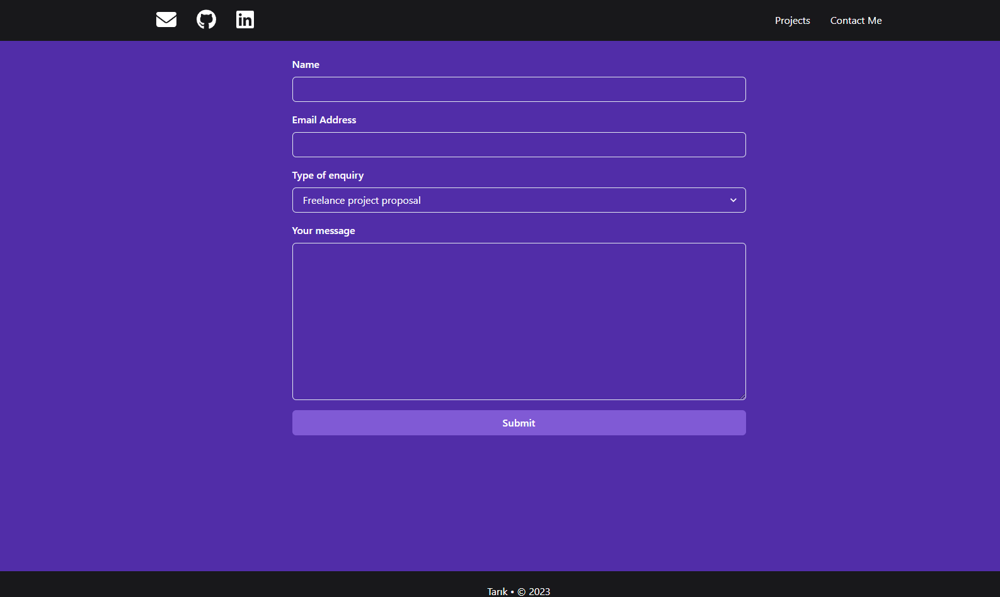

# My Portfolio React App

Welcome to my portfolio React app! This project serves as an introduction to who I am, showcases my recent projects, and provides a form to get in touch with me.




## Table of Contents

- [About](#about)
- [Technologies](#technologies)
- [Getting Started](#getting-started)

## About

This portfolio app is designed to provide visitors with a glimpse into my skills, background, and the projects I've worked on. It offers the following sections:

- **About Me**: A brief introduction to who I am and my professional background.

- **Projects**: A showcase of my recent projects with descriptions, technologies used, and links to live demos or GitHub repositories.

- **Contact**: A contact form that allows visitors to get in touch with me.

## Technologies

- **React**: The app is built using React, a popular JavaScript library for building user interfaces.

- **Chakra UI**: Chakra UI is used for styling and theming, providing a clean and visually appealing design.

- **Formik and Yup**: Formik is used to handle the contact form, and Yup is used for form validation.

## Getting Started

To run this project locally, follow these steps:

1. Clone the repository:

   ```bash
   git clone https://github.com/tarikliman/my-portfolio.git
